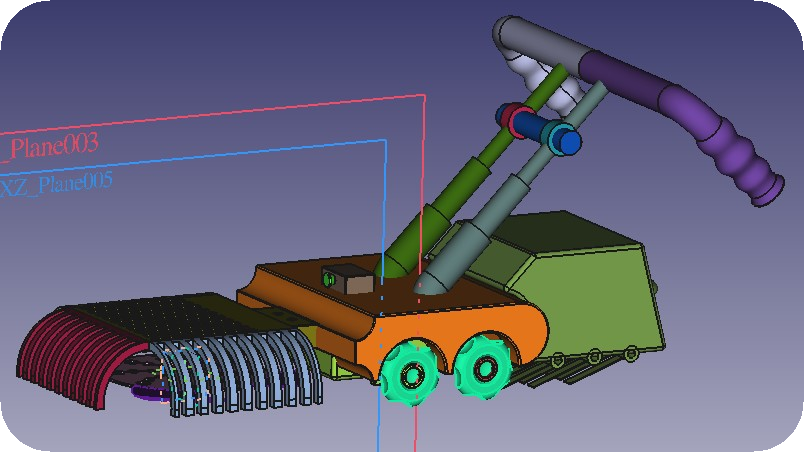
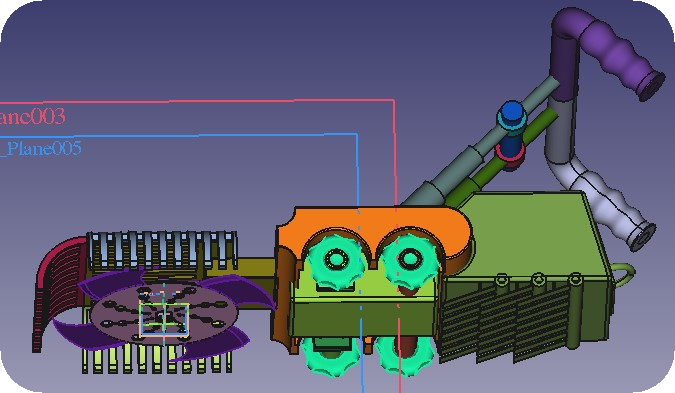

# Prod-Dev
This project consist of designing and modelling a common product : <strong>Lawn Mower</strong>.
##### To edit or modify the model open the file [`lawn_mower.FCStd`](lawn_mower.FCStd) in [FreeCAD](https://www.freecadweb.org/index.php).
##### Have a look at the 3-D model in the files [`lawn_mower.stl`](lawn_mower.stl) or [`lawn_mower.stl.glb`](lawn_mower.stl.glb). Note: since the files are large so github won't be able to render them. Try downloading them and then viewing them in a CAD software.

### Salient Features of the Design
> <b><ins>Blades (Comb-Knife idea)</ins>:</b> There is one circular blade at the bottom of the car. With this, we
are adding another three comb like structured blades. It will help with cutting relatively
large grasses, weeds or just collecting any plastic bags or chips packet. This blade will
serve as a protector thereby preventing a situation where a very thin plastic directly comes with the main rotating blade, and is patched up causing
damage to the machinery. Ever thought why a barber cuts your hair with a knife and a comb?
The combination of the circular blade and the front part of the mower has this comb like design making grass cutting extremely efficient.

> <b><ins>Unique Motor Mount structure with the effect of ventilation</ins>:</b> The fan like object near the
mower blade is a part of the motor. It draws in air to allow proper ventilation and keeps the
motor cool to some extent and enhances propelling out cut grasses.

> <b><ins>Ergonomic design of handle</ins>:</b> The handle has a ergonomic design meaning it can be really
easy and comfortable gripping it by hand. Moreover the height of the handle is adjustable thus catering to
persons of different height (if you see the slanted rods in the model you will
observe that the rods slide into one another, much the same way as you see a selfie
stick expand). Thus the mower has a compact design with amazing expandability. The
handle can also be titlted by the user depending on his/her choice.

### Some screenshots taken from FreeCAD
 

 

